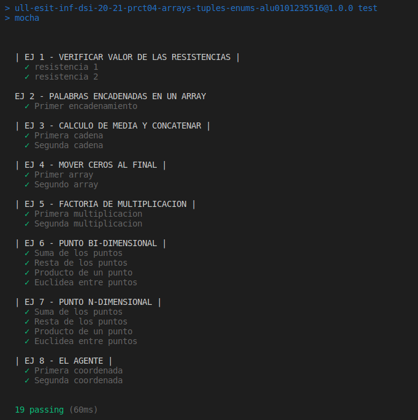

# Informe. Práctica 4: Arrays, Tuplas y Enumerados.
## Desarrollo de Sistemas Informáticos.
#### ADRIAN HERNANDEZ SUAREZ - alu0101235516@ull.edu.es


### _**Introducción.**_

  Para llevar a cabo este informe, hemos tenido que realizar 8 ejercicios diferentes acerca de la utilización de arrays, tuplas o enumerados. Cada ejercico es diferente a otro y con eso hemos conseguido mayor diversidad y mayor conocimiento acerca de diferentes áreas del **TypeScript**, como utilización de métodos muy útiles como `.push()`  o `typeof` que veremos a lo largo de este informe.

### _**Objetivos.**_

  El objetivo de esta práctica es resolver una serie de ejercicios de programación que nos permitirán conocer más en profundidad, toda la utilización y la mayor eficacia que te dan los arrays, las tuplas o los enumerados para la realización de las funciones en **TypeScript**.

### _**Primer paso: Creación de los directorios de trabajo**_

  Para completar este primer apartado, tendremos que seguir los pasos que se muestran en el siguiente enlace [Creación de un proyecto inicial para trabajar con TypeScript](https://ull-esit-inf-dsi-2021.github.io/typescript-theory/typescript-project-setup.html) con esto lo que conseguiremos será crear un espacio de trabajo ideal para comenzar con el desarrollo de los ejercicios propuestos.
  Cuando tengamos esta parte realizada, tendremos creado un directorio llamado `./src`, en este directorio es donde alojaremos todos los ejercicios que vayamos haciendo, cada uno en un fichero independiente con la siguiente notación `ejercicio-n.ts`.
  
### _**Segundo paso: Instalación de mocha y chai.  Además de la configuración de TypeDoc**_
  
  Una vez tengamos hecho el primer paso de esta práctica tendremos que hacer la instalación de TypeDoc, esto es un generador automático de documentación para proyectos de **TypeScript**.  Para conocer mejor esto y seguir la instalación y configuración correctamente, mire el siguiente enlace [Instalación y Configuración de TypeDoc](https://drive.google.com/file/d/19LLLCuWg7u0TjjKz9q8ZhOXgbrKtPUme/view). 
  Cuando tengamos la documentación creada, tendremos que proceder a la instalación de `Mocha` y de `Chai`. Para conocer mejor su funcionamiento y ver la correcta pauta de instalación, siga el siguiente enlace [Instalación y Configuración de Mocha y Chai](https://drive.google.com/file/d/1-z1oNOZP70WBDyhaaUijjHvFtqd6eAmJ/view).
  
  Cuando tengamos todo esto listo, lo que conseguiremos es hacer un TDD del proyecto, es decir, las pruebas unitarias. Utilizando el comando `npm test` podremos ejecutar dichas pruebas, viendo si la función que hemos creado, es correcta o no. Para dar validez y constancia de esto, tendremos que hacer un commit antes de la realización del código y con el test hecho, viendo como falla dicho test, y luego tendremos que hacer otro commit después de la correcta realización del código para dar constancia de que esta bien realizado.

### _**Tercer paso: Realizar los ejercicios propuestos**_
### Ejercicio 1 - Decodificar resistencias.

  **Enunciado a realizar**

Cree una función `decodeResistor` que recibe como parámetros los nombres de los colores de una resistencia como entrada y devuelve un número de dos dígitos indicando el valor de la resistencia. La función deberá devover un número de dos dígitos incluso si recibe más de dos colores como parámetros. Los colores tendrán los siguientes valores:

  - Negro: 0
  - Marrón: 1
  - Rojo: 2
  - Naranja: 3
  - Amarillo: 4
  - Verde: 5
  - Azul: 6
  - Violeta: 7
  - Gris: 8
  - Blanco: 9

  **La funcion para la realización de este ejercicio ha sido el siguiente:**
  
```TypeScript
export function decodeResistor(resistor: string[]) {
  const colors:[string, number][] = [["Negro", 0], ["Marron", 1], ["Rojo", 2], ["Naranja", 3], ["Amarillo", 4],
    ["Verde", 5], ["Azul", 6], ["Violeta", 7], ["Gris", 8], ["Blanco", 9]];

  let output: number = 0;
  let i: number = 0;
  let j: number = 0;

  while (i < colors.length && j < 2) {
    if ( colors[i][0] == resistor[j]) {
      output += colors[i][1];
      i = -1;
      j++;
    }
    i++;
  }
  return output;
}
```
  La funcion responde de la siguiente manera, a nuestra función `decodeResistor` le pasamos como parámetro un array de tipo `string`, declararemos una constante la cual es una tupla de tipo `string, number` esto significa que nuestra tupla tendrá dos posiciones, donde la primera mostrará el nombre del color, y la segunda su posición. 
  La parte principal de mi función es la utilización del bucle `while`, lo que hace este bucle es que mientras estemos recorriendo nuestra constante `colors` y hasta que lleguemos a la segunda banda de color de la resistencia se estará ejecutando. Dentro del while tengo una condición `if` en la cual accederemos únicamente cuando el nombre del color de la banda de la resistencia, esté dentro de nuestra tupla `colors`, si es el caso, acumularemos en nuestra salida `output` el valor de dicha banda que se irá sumando para dar el valor final, resetearemos la i a -1 para que cuando salga del `if`, que es cuando pasamos al siguiente color de la banda, volvamos a recorrer la tupla `colors` desde el inicio.
  
  **Aqui tenemos el test del código:**
    
```TypeScript
import 'mocha';
import {expect} from 'chai';
import {decodeResistor} from '../src/ejercicio-1';


describe('| EJ 1 - VERIFICAR VALOR DE LAS RESISTENCIAS |', () => {
  it('resistencia 1', () => {
    expect(decodeResistor(["Rojo", "Violeta"])).to.be.equal(9);
  });
  it('resistencia 2', () => {
    expect(decodeResistor(["Amarillo", "Blanco", "Gris"])).to.be.equal(13);
  });
});
```
 
 
 ### Ejercicio 2 - Notación decimal y factorial.

  **Enunciado a realizar**
    
   Escriba una función meshArray que compruebe si las cadenas del array están encadenadas o no. La función recibirá como parámetro un array de cadenas de texto y devolverá:

   - “Error al encadenar” si las cadenas del array no están encadenadas.
   - Una cadena de texto que contenga las letras que encadenan las palabras del array. A priori no sabe cuantas letras encadenadas tendrán en común, pero al menos será una.
 
  **La funcion para la realización de este ejercicio ha sido el siguiente:**
  
```TypeScript
 export function meshArray(palStr: string[]) {
  let output: string = ``;
  for (let i: number = 0; i < palStr.length - 1; i++) {
    const palb: string = palStr[i];
    const nextPalb: string = palStr[i + 1];
    let pos: number= palb.length - 1;
    let posnextPalb: number = 0;
    while (palb[pos] != nextPalb[posnextPalb]) {
      pos--;
      if (pos < 0) {
        return `Error en el encadenamiento`;
      }
    }
    for (let j: number = pos; j < palb.length; j++) {
      if (palb[j] == nextPalb[posnextPalb]) {
        output = output + palb[j];
        posnextPalb++;
      } else {
        return `Error en el encadenamiento`;
      }
    }
  }
  return output;
}
```
   La función `meshArray` funciona de la siguiente manera, recibe como parámetro un array de tipo string. Primero realizaremos un bucle `for` para recorrer el array. La función tiene declarada las variables `palb` y `nextPalb` las cuales apuntan a la cadena actual con la siguiente.
   Dentro de este bucle, tenemos un bucle `while` el cual nos sirve para recorrer el array del final al inicio viendo si coincidide con la primera letra de la siguiente palabra de la cadena, en el caso de no encontrar una coincidencia retornamos `Error en el encadenamiento`. 
   Luego tendremos otro bucle `for` que ira desde la posicion en la que encontró dos letras iguales e iran avanzando y comprobando letra por letra, en el caso de que recorra hasta el final de la palabra las añade a un array de encontrar un error de coincidencia, retornará `Error en el encadenamiento`. 
   Finalmente, si el todas las palabras se pueden encadenar retornará una cadena con todas las letras usadas a encadenar.
   
  **Aqui tenemos el test del código:**
    
 ```TypeScript
import 'mocha';
import {expect} from 'chai';
import {meshArray} from '../src/ejercicio-2';

describe('EJ 2 - PALABRAS ENCADENADAS EN UN ARRAY', () => {
  it('Primer encadenamiento', () => {
    expect(meshArray([`allow`, `lowering`, `ringmaster`, `terror`])).to.be.equal(`lowringter`);
  });
});
```
 
 
  ### Ejercicio 3 - Calcular la media y concatenerar cadenas.
 
   **Enunciado a realizar**

Escriba una función `meanAndConcatenate` que reciba como parámetro un array que incluye caracteres de texto y números. La función deberá devolver como resultado un array con dos valores:

  - La media de los valores numéricos.
  - Una cadena resultado de la concatenación de caracteres del array recibido.

  **La funcion para la realización de este ejercicio ha sido el siguiente:**
  
```TypeScript
export function meanAndConcatenate(str: (number | string)[]) {
  let numCad: number = 0;
  let letrCad: string = "";
  let count: number = 0;
  let output: [number, string] = [0, ""];

  str.forEach((item) => {
    if (typeof item === "number") {
      numCad += item;
      count++;
    } else {
      letrCad += item;
    }
  });

  numCad = numCad / count;
  output = [numCad, letrCad];
  return output;
}
```
  La función `meanAndConcatenate` funciona de la siguiente manera, recibe como parámetro un array de tipo string **ó** de tipo number. Cuando el usuario le mande un array a la función con números y letras, mi función recorrerá cada item, cada posición del array utilizando un bucle `forEach` con un condicional `if` el cual usando el método `typeof` mira si el item es de tipo number y si es el caso, lo mete dentro de la variable `numCad` la cual hace la suma de todos los números que tenga nuestro array y aumenta el contador de las veces que hemos entrado en esa condición. Haciendo eso, lo que conseguimos es que más adelante hallemos la media de los números. En el caso de no entrar acumularemos las letras en otra cadena. 
  Finalmente, calculamos la media de los números y en nuestra variable de salida `output` que es un array de tipo `number, string`, mostrará por un lado la media y por otro las letras concatenadas.
  
  **Aqui tenemos el test del código:**
    
```TypeScript
import 'mocha';
import {expect} from 'chai';
import {meanAndConcatenate} from '../src/ejercicio-3';

describe('| EJ 3 - CALCULO DE MEDIA Y CONCATENAR |', () => {
  it('Primera cadena', () => {
    expect(meanAndConcatenate(['u', 6, 't', 2, 'r', 'e', 0, 'r', 2])).to.deep.equal([2.5, 'utrer']);
  });
  it('Segunda cadena', () => {
    expect(meanAndConcatenate(['u', 6, 't', 2, 'r', 'e', 0, 'r', 2])).to.deep.equal([2.5, 'utrer']);
  });
});
```


 ### Ejercicio 4 - Mover los ceros al final.
 
   **Enunciado a realizar**
 
Dado un array de números, escriba una función `moveZeros` que reciba como parámetro dicho array y mueva todos los ceros presentes en el array al final del mismo. El array debe mantener el mismo orden respecto al resto de elementos.

  **La funcion para la realización de este ejercicio ha sido el siguiente:**
  
```TypeScript
export function moveZeros(ZerosCad: number[]) {
  const NewCad: number[] = [];
  let count: number = ZerosCad.length;

  ZerosCad.forEach((item) => {
    if (item != 0) {
      NewCad.push(item);
      count--;
    }
  });
  while (count != 0) {
    count--;
    NewCad.push(0);
  }
  return NewCad;
}
```
  La función `moveZeros` funcionan de la siguiente manera, a la función le va a llegar un parámetro array de tipo number, como lo tenemos que mostrar en una nueva cadena, creamos una constante llamada `NewCad` la cual almacenará el nuevo array al final. Primero nuestra función recorrerá nuestro array con un `forEach`, dentro de este recorrido, tenemos un condicional `if`que si el item es diferente a 0, haremos un `push(item)` para almacenarlo en el nuevo array, además como declaré una variable contador `count` la cual tiene el tamaño del array que le hemos pasado, lo que hará es decrementar cada vez que accedamos a este condicional para ver la cantidad de 0 que tengamos que añadir al final.
  Cuando recorra todo el array, lo que haremos con el bucle `while` de abajo, es añadir la cantidad de 0 que con la variable `count` hemos almacenado. Finalmente, retornamos la nueva cadena con la función al final.
  
  **Aqui tenemos el test del código:**
  
```TypeScript
import 'mocha';
import {expect} from 'chai';
import {moveZeros} from '../src/ejercicio-4';

describe('| EJ 4 - MOVER CEROS AL FINAL |', () => {
  it('Primer array', () => {
    expect(moveZeros([1, 0, 1, 2, 0, 1, 3])).to.deep.equal([1, 1, 2, 1, 3, 0, 0]);
  });
  it('Segundo array', () => {
    expect(moveZeros([1, 2, 1, 0, 7, 1, 0])).to.deep.equal([1, 2, 1, 7, 1, 0, 0]);
  });
});
```
   

### Ejercicio 5 - Factoría de multiplicación.
 
  **Enunciado a realizar**
  
Cree una función `multiplyAll` que tome como parámetro un array de números. Esta función deberá devolver como resultado otra función que toma como argumento un único valor numérico y devuelve un nuevo array. El array devuelto por la segunda función debe ser el resultado de la multiplicación de los números del array por el valor numérico que recibe la segunda función.

  **La funcion para la realización de este ejercicio ha sido el siguiente:**
  
```TypeScript
export function multiplyAll(factoria: number[]) {
  return (multiply: number) => {
    const output: number[] = [];
    factoria.forEach((element) => {
      output.push(element * multiply);
    });
    return output;
  };
}
}
```
  La función `multiplyAll` funciona de la siguiente manera, recibe como parámetro un array de tipo number y como hemos hecho uso de la `función anónima` tendremos que darle otro valor de tipo number a la función. Dentro del código, la función trabaja tal que en un nuevo array de tipo number haciendo uso del método `.push()` y recorriendo el array que le proporciona el usuario, pushearemos cada elemento del array multiplicado por la constante que le proporcionamos, en el nuevo array de salida. Finalmente, retornaremos dicho array.
  
  **Aqui tenemos el test del código:**
  
```TypeScript
import 'mocha';
import {expect} from 'chai';
import {multiplyAll} from '../src/ejercicio-5';


describe('| EJ 5 - FACTORIA DE MULTIPLICACION |', () => {
  it('Primera multiplicacion', () => {
    expect(multiplyAll([4, 2, 3])(2)).to.deep.equal([8, 4, 6]);
  });
  it('Segunda multiplicacion', () => {
    expect(multiplyAll([4, 2, 3])(3)).to.deep.equal([12, 6, 9]);
  });
});
```
  
### Ejercicio 6 - Puntos bi-dimensionales.

  **Enunciado a realizar**

Un punto describe una posición determinada respecto a un sistema de coordenadas preestablecido. Suponiendo un sistema de dos coordenadas (x, y), un punto en el espacio se denotaría de la forma Point(X, Y). A partir de la siguiente definición, cree un tipo de dato capaz de definir un punto bidimensional.

  **La funcion para la realización de este ejercicio ha sido el siguiente:**
  
  ```TypeScript
 type Point = [number, number]

export function sumar(PrimerPunto: Point, SegundoPunto: Point) {
  const PointResult: Point = [0, 0];

  PointResult[0] = PrimerPunto[0] + SegundoPunto[0];
  PointResult[1] = PrimerPunto[1] + SegundoPunto[1];
  return PointResult;
}

export function restar(PrimerPunto: Point, SegundoPunto: Point) {
  const PointResult: Point = [0, 0];

  PointResult[0] = PrimerPunto[0] - SegundoPunto[0];
  PointResult[1] = PrimerPunto[1] - SegundoPunto[1];
  return PointResult;
}

export function producto(PrimerPunto: Point, cons: number) {
  const PointResult: Point = [0, 0];

  PointResult[0] = PrimerPunto[0] * cons;
  PointResult[1] = PrimerPunto[1] * cons;
  return PointResult;
}

export function euclidea(PrimerPunto: Point, SegundoPunto: Point) {
  let pt1Pow: number = 0;
  let pt2Pow: number = 0;
  let distancia: number = 0;

  pt1Pow = Math.pow((SegundoPunto[0] - PrimerPunto[0]), 2);
  pt2Pow = Math.pow((SegundoPunto[1] - PrimerPunto[1]), 2);

  distancia = Math.sqrt(pt1Pow + pt2Pow);
  return parseFloat(distancia.toFixed(4));
}
```
En este ejercicio he hecho varias funciones para cada método. Una función para sumar, restar, producto y euclídea.

- La función `sumar` funciona de la siguiente manera. Le pasamos como parámetros el primero punto de coordenadas que es de tipo `Point` y el segundo punto de coordenadas que también es de tipo `Point`. El tipo `Point` lo he declarado fuera de las funciones, este tipo funciona como un array de variable `[number, number]`. He creado un nuevo array de tipo `Point` inicializada en 0, lo que hacemos dentro de la función es sumar cada posición de los arrays de entrada y almacenarlo en cada posición del array de salida. Fnalmente retornamos el array de salida.

- La función `restar` funciona de la siguiente manera. Le pasamos como parámetros el primero punto de coordenadas que es de tipo `Point` y el segundo punto de coordenadas que también es de tipo `Point`. El tipo `Point` lo he declarado fuera de las funciones, este tipo funciona como un array de variable `[number, number]`. He creado un nuevo array de tipo `Point` inicializada en 0, lo que hacemos dentro de la función es restar cada posición de los arrays de entrada y almacenarlo en cada posición del array de salida. Fnalmente retornamos el array de salida.

- La función `producto` funciona de la siguiente manera. Le pasamos como parámetros el primero punto de coordenadas que es de tipo `Point` y la constante a multiplicar de tipo `number`. El tipo `Point` lo he declarado fuera de las funciones, este tipo funciona como un array de variable `[number, number]`. He creado un nuevo array de tipo `Point` inicializada en 0, lo que hacemos dentro de la función es multiplicar cada posición del array de entrada por la constante y almacenarlo en cada posición del array de salida. Fnalmente retornamos el array de salida.

- La función `euclidea` funciona de la siguiente manera. Le pasamos como parámetros el primero punto de coordenadas que es de tipo `Point` y el segundo punto de coordenadas que también es de tipo `Point`. El tipo `Point` lo he declarado fuera de las funciones, este tipo funciona como un array de variable `[number, number]`. He creado un nuevo array de tipo `Point` inicializada en 0, lo que hacemos dentro de la función es sumar cada posición de los arrays de entrada y almacenarlo en cada posición del array de salida. Fnalmente retornamos el array de salida.
  
   **Aqui tenemos el test del código:**
   
```TypeScript
import 'mocha';
import {expect} from 'chai';
import {sumar} from '../src/ejercicio-6';
import {restar} from '../src/ejercicio-6';
import {producto} from '../src/ejercicio-6';
import {euclidea} from '../src/ejercicio-6';


describe('| EJ 6 - PUNTO BI-DIMENSIONAL |', () => {
  it('Suma de los puntos', () => {
    expect(sumar([4, 2], [1, 3])).to.deep.equal([5, 5]);
  });
  it('Resta de los puntos', () => {
    expect(restar([4, 2], [1, 3])).to.deep.equal([3, -1]);
  });
  it('Producto de un punto', () => {
    expect(producto([4, 2], 2)).to.deep.equal([8, 4]);
  });
  it('Euclidea entre puntos', () => {
    expect(euclidea([4, 2], [1, 3])).to.deep.equal(3.1623);
  });
});
```


 ### Ejercicio 7 - Puntos n-dimensionales.

  **Enunciado a realizar**
  
   A partir del desarrollo realizado para el ejericio anterior, cree un tipo de datos que sea capaz de definir puntos de 3 o más dimensiones. Esto es, un punto debe tener, como mínimo, tres dimensiones y, como máximo, las que el usuario desee.

   **La funcion para la realización de este ejercicio ha sido el siguiente:**
  
```TypeScript
type Point = [number, number, number, ...number[]]

export function sumar(PrimerPunto: Point, SegundoPunto: Point) {
  const PointResult: Point = [0, 0, 0];

  if (PrimerPunto.length == SegundoPunto.length) {
    let i: number = 0;
    PrimerPunto.forEach((element) => {
      PointResult[i] = element + SegundoPunto[i];
      i++;
    });
    return PointResult;
  } else {
    return "ERROR: Los puntos tienen que tener el mismo tamaño!";
  }
}

export function restar(PrimerPunto: Point, SegundoPunto: Point) {
  const PointResult: Point = [0, 0, 0];

  if (PrimerPunto.length == SegundoPunto.length) {
    let i: number = 0;
    PrimerPunto.forEach((element) => {
      PointResult[i] = element - SegundoPunto[i];
      i++;
    });
    return PointResult;
  } else {
    return "ERROR: Los puntos tienen que tener el mismo tamaño!";
  }
}

export function producto(PrimerPunto: Point, cons: number) {
  const PointResult: Point = [0, 0, 0];

  let i: number = 0;
  PrimerPunto.forEach((element) => {
    PointResult[i] = element * cons;
    i++;
  });
  return PointResult;
}

export function euclidea(PrimerPunto: Point, SegundoPunto: Point) {
  let pt1Pow: number = 0;
  let distancia: number = 0;

  if (PrimerPunto.length == SegundoPunto.length) {
    let i: number = 0;
    SegundoPunto.forEach((element) => {
      pt1Pow = Math.pow((element - PrimerPunto[i]), 2);
      i++;
    });
    distancia = Math.sqrt(pt1Pow);
    return parseFloat(distancia.toFixed(4));
  } else {
    return "ERROR: Los puntos tienen que tener el mismo tamaño!";
  }
}
```
  Este ejercicio es parecido al interior, los cambios más principales es la declaración del tipo `Point`, ahora nuestro tipo `Point` tiene como mínimo tres dimensioones, y tiene como máximo las que el usuario desee, esto lo conseguimos, declarando el tipo `Point`de la siguiente manera `type Point = [number, number, number, ...number[]]`.
  Una vez hecho este cambio, la diferencia no es tan notable, voy a pasar a explicar como sería el cambio para la función `sumar` ya que con las demás funciones tendremos que usar el mismo Modus Operandi.
  - Para la función `sumar`, primero tenemos un condicional para verificar de que el primer punto y el segundo tienen el mismo tamaño, si no tienen el mismo tamaño, retornamos un error de tamaño. Una vez se verifique este condicional lo que hace la función, es recorrer el primer punto de coordenadas, inicializamos una variable `i` que la usaremos de índice para poder recorrer el segundo punto de coordenadas al mismo tiempo, sumar las mismas posiciones y finalmente acumularlo en la variable de salida de tipo `Point`.

Este proceso se utilizará en las demás funciones de la misma manera.
  
   **Aqui tenemos el test del código:**
   
```TypeScript
import 'mocha';
import {expect} from 'chai';
import {sumar} from '../src/ejercicio-7';
import {restar} from '../src/ejercicio-7';
import {producto} from '../src/ejercicio-7';
import {euclidea} from '../src/ejercicio-7';


describe('| EJ 7 - PUNTO N-DIMENSIONAL |', () => {
  it('Suma de los puntos', () => {
    expect(sumar([4, 2, 5, 7], [1, 2, 3, 2])).to.deep.equal([5, 4, 8, 9]);
  });
  it('Resta de los puntos', () => {
    expect(restar([4, 2, 5, 7], [1, 2, 3, 2])).to.deep.equal([3, 0, 2, 5]);
  });
  it('Producto de un punto', () => {
    expect(producto([4, 2, 5, 7], 2)).to.deep.equal([8, 4, 10, 14]);
  });
  it('Euclidea entre puntos', () => {
    expect(euclidea([4, 2, 5, 7], [1, 2, 3, 2])).to.deep.equal(5);
  });
});
```
  
### Ejercicio 8 - El agente.
 
   **Enunciado a realizar**

A partir de un tablero bidimensional con tamaño [X, Y], donde X es el número de filas e Y el número de columnas. Considere que un agente está situado en un punto del tablero con coordenadas $(x_0, y_0)$ y tiene que llegar a un objetivo $(x_1, y_1)$. Para lograrlo, el agente solo puede realizar movimientos en los puntos cardinales, esto es, Norte, Sur, Este y Oeste. Tenga en cuenta que los movimientos positivos en el eje Y serán hacia el Norte y los negativos hacia el Sur. Del mismo modo, los movimientos positivos en el eje X serán hacia el Este y los negativos hacia el Oeste.

  **La funcion para la realización de este ejercicio ha sido el siguiente:**
  
  ```TypeScript
export function agent(X: number, Y: number, initialPoint: number[], finalPoint: number[]) {
  if ((initialPoint[0] > X) || (initialPoint[1] > Y) || (finalPoint[0] > X) || (finalPoint[1] > Y)) {
    return "ERROR: La posición inicial o final no puede superar el tamaño del tablero";
  }

  const camino: string[] = [];

  while (initialPoint[0] != finalPoint[0]) {
    if (initialPoint[0] < finalPoint[0]) {
      camino.push("East");
      initialPoint[0]++;
    }
    if (initialPoint[0] > finalPoint[0]) {
      camino.push("West");
      initialPoint[0]--;
    }
  }
  while (initialPoint[1] != finalPoint[1]) {
    if (initialPoint[1] < finalPoint[1]) {
      camino.push("North");
      initialPoint[1]++;
    }
    if (initialPoint[1] > finalPoint[1]) {
      camino.push("South");
      initialPoint[1]--;
    }
  }
  return camino;
}
```
  La función `agent` funciona de la siguiente manera, recibe como parámetros el tamaño del tablero X e Y de tipo `number` y el punto inicial y final como un array de tipo `number`. Primero comprobamos que ningun punto de las coordenadas de inicio y final este fuera del tablero. Cuando esto se cumple, utilizaremos un bucle `while` que mientras el punto de inicio sea diferente al final, siga recorriendo el tablero, dentro de este bucle tenemos diferentes condicionales, que usaremos para ver en que dirección se va a tener que mover el agente para llegar al punto final.
  
  - Si la coordenada X de la posición inicial es menor que la final, el agente se tendrá que mover al Este, e incrementa la posición en 1.
  - Si la coordenada X de la posición inicial es mayor que la final, el agente se tendrá que mover al Oeste y decrementa la posición en 1.
  - Si la coordenada Y de la posición inicial es menor que la final, el agente se tendrá que mover al Norte, e incrementa la posición en 1.
  - Si la coordenada Y de la posición inicial es mayor que la final, el agente se tendrá que mover al Sur y decrementa la posición en 1.
 
 Cada vez que haga una condición de estas, haremos un `push()` de la dirección del movimiento del agente a un array de salida que llamé camino. Finalmente, cuando salgamos del bucle, es decir, que el punto final e inicial es el mismo, retornaremos el camino que ha hecho el agente.
  
   **Aqui tenemos el test del código:**
   
```TypeScript
import 'mocha';
import {expect} from 'chai';
import {agent} from '../src/ejercicio-8';

describe('| EJ 8 - EL AGENTE |', () => {
  it('Primera coordenada', () => {
    expect(agent(10, 10, [1, 3], [3, 5])).to.deep.equal(['East', 'East', 'North', 'North']);
  });
  it('Segunda coordenada', () => {
    expect(agent(10, 10, [3, 7], [1, 2])).to.deep.equal(['West', 'West', 'South', 'South', 'South', 'South', 'South']);
  });
});
```
### _**Test de todos los ejercicios.**_  
  
  
  
  
### Conclusiones.

  Para concluir, creo que la práctica ha estado divertida, y ha sido productiva, hemos tocado muchos puntos de TypeScript, descubierto muchas herramientas muy útiles, y desarrollado nuestra primera estructura de proyecto. En cuanto a los ejercicios creo que tengo que destacar la dificultad del ejercicio 2, que ha sido el que más me ha costado, pero también tenemos que destacar otras funciones muy divertidas como el ejercicio 4, 7, 8 y otras muy interesantes como el ejercicio 1 y 5. Creo que ha diferencia de la práctica anterior, el uso de tuplas, arrays, o enumerables facilita muchísimo la tarea de algunas funciones, y las simplifica mucho. Ahora me parece mejor programar en TypeScript o JavaScript que en C++, incluso en otras asignaturas como Seguridad de Sistemas, he estado haciendo las prácticas en JavaScript y mezclarlo con HTML y CSS para su visualización. De momento me esta gustando mucho la asignatura, y espero que siga yendo así.


### _**Bibliografía.**_

Nombre | Enlaces
-------|--------
Introducción a Markdown | https://guides.github.com/features/mastering-markdown/
Información sobre GitHub Pages | https://docs.github.com/en/github/working-with-github-pages
Sitio web de Jekyll | https://jekyllrb.com/
GutHub Learning Lab | https://lab.github.com/
Curso de GitHub Pages | https://lab.github.com/githubtraining/github-pages
Visual Studio Code | https://code.visualstudio.com/
Instalar Visual Studio Code | https://code.visualstudio.com/docs/setup/setup-overview
Tutorial VSCode sobre Additional Components | https://code.visualstudio.com/docs/setup/additional-components
Tutorial VSCode sobre User Interface | https://code.visualstudio.com/docs/getstarted/userinterface
Tutorial VSCode sobre Basic Editing | https://code.visualstudio.com/docs/editor/codebasics
Tutorial VSCode sobre Extension MarketPlace | https://code.visualstudio.com/docs/editor/extension-gallery
Tutorial VSCode sobre IntelliSense | https://code.visualstudio.com/docs/editor/intellisense
Tutorial VSCode sobre Code Navigation | https://code.visualstudio.com/docs/editor/editingevolved
Tutorial VSCode sobre Debugging | https://code.visualstudio.com/docs/editor/debugging
Tutorial VSCode sobre Version Control | https://code.visualstudio.com/docs/editor/versioncontrol
Tutorial VSCode sobre Working with GitHub | https://code.visualstudio.com/docs/editor/github
Tutorial VSCode sobre Integrated Terminal | https://code.visualstudio.com/docs/editor/integrated-terminal
Tutorial VSCode sobre Tasks | https://code.visualstudio.com/docs/editor/tasks
Tutorial VSCode sobre Snippets | https://code.visualstudio.com/docs/editor/userdefinedsnippets
Tutorial VSCode sobre Emmet | https://code.visualstudio.com/docs/editor/emmet
Tutorial VSCode sobre Command Line | https://code.visualstudio.com/docs/editor/command-line
Tutorial VSCode sobre  Multiroot Workspaces | https://code.visualstudio.com/docs/editor/multi-root-workspaces
Tutorial VSCode sobre  Accessibility | https://code.visualstudio.com/docs/editor/accessibility
Conectarnos desde VSCode a una máquina remota por SSH | https://code.visualstudio.com/docs/remote/ssh-tutorial
Informe de la práctica 1 de DSI | https://ull-esit-inf-dsi-2021.github.io/ull-esit-inf-dsi-20-21-prct01-iaas-alu0101206479/
Live Share Extension Pack | https://marketplace.visualstudio.com/items?itemName=MS-vsliveshare.vsliveshare-pack
Documentación de Visual Studio Live Share | https://docs.microsoft.com/en-us/visualstudio/liveshare/
Libro Essential TypeScript: From Beginner to Pro | https://learning.oreilly.com/library/view/essential-typescript-from/9781484249796/html/Part_1.xhtml
